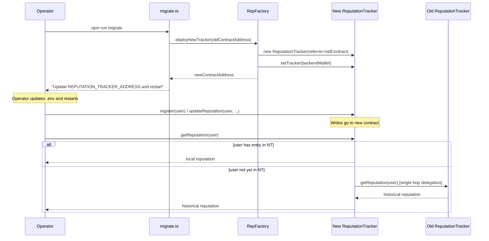

# Backend Tracker Server

This directory contains the Express.js tracker server for the Persistent BitTorrent Tracker System (PBTS).

## Structure

```
backend/
├── config/
│   └── index.ts          # Typed config loaded from environment variables
├── routes/
│   ├── register.ts       # POST /register
│   ├── report.ts         # POST /report
│   └── announce.ts       # POST /announce
├── scripts/
│   ├── deploy.ts         # Full initial deployment (factory + first tracker)
│   ├── migrate.ts        # Controlled migration to a new tracker contract
│   ├── status.ts         # Show contract status, referrer chain, reputation
│   ├── register.ts       # Register deployer wallet via the API
│   └── announce.ts       # Test announce via the API
├── client/
│   ├── index.ts          # PBTSClient — WebTorrent + receipt integration
│   ├── cli.ts            # CLI demo tool
│   └── receiptGenerator.ts  # Cryptographic receipt signing & attribution
├── utils/
│   ├── signatures.ts     # ECDSA signature verification helpers
│   └── contract.ts       # ethers.js wrappers for ReputationTracker & RepFactory
├── tests/
│   ├── setup.ts          # Jest environment setup (dummy env vars)
│   ├── api.test.ts       # Integration tests for all endpoints
│   ├── receiptGenerator.test.ts  # Unit tests for ReceiptGenerator
│   └── signatures.test.ts
└── server.ts             # Express app + server entry point
```

## Technology Stack

- **Runtime**: Node.js 18+
- **Framework**: Express.js
- **Blockchain**: ethers.js v6
- **Networks**: Ethereum Sepolia (chain 11155111) or Avalanche Fuji (chain 43113)

## Environment Variables

Copy `.env.example` from the repository root to `backend/.env` and fill in your values. The backend resolves the RPC URL in priority order: `RPC_URL` > `ETH_SEPOLIA_RPC_URL` > `AVALANCHE_FUJI_RPC_URL`.

| Variable | Required | Description |
|---|---|---|
| `DEPLOYER_PRIVATE_KEY` | Yes | Private key of the tracker wallet (pays gas) |
| `REPUTATION_TRACKER_ADDRESS` | Yes | Currently active `ReputationTracker` contract |
| `FACTORY_ADDRESS` | Yes | Deployed `RepFactory` contract (used during migration) |
| `ADMIN_SECRET` | Yes | Bearer token for the `/migrate` admin endpoint |
| `RPC_URL` | No | Generic JSON-RPC endpoint (highest priority) |
| `ETH_SEPOLIA_RPC_URL` | No | Sepolia RPC endpoint (second priority) |
| `AVALANCHE_FUJI_RPC_URL` | No | Fuji RPC endpoint (third priority; defaults to public Fuji) |
| `CHAIN_ID` | No | Chain ID; auto-inferred from RPC URL if omitted |
| `PORT` | No | Server port (default: `3001`) |
| `NODE_ENV` | No | Environment name (default: `development`) |
| `MIN_RATIO` | No | Minimum upload/download ratio for access (default: `0.5`) |
| `TIMESTAMP_WINDOW_SECONDS` | No | Receipt freshness window in seconds (default: `300`) |

## API Endpoints

### `POST /register`

Register a new user on-chain.

**Request body**
```json
{
  "userAddress": "0x...",
  "message": "Register PBTS account: 0x...",
  "signature": "0x..."
}
```

**Responses**
- `201` — Registration successful; returns `txHash` and `initialCredit` (1 GiB)
- `400` — Missing fields or invalid address
- `401` — Invalid signature
- `409` — User already registered

---

### `POST /report`

Submit a cryptographic transfer receipt. Updates the sender's upload count and the receiver's download count on-chain.

**Request body**
```json
{
  "infohash": "0x...",
  "sender": "0x...",
  "receiver": "0x...",
  "pieceHash": "0x...",
  "pieceIndex": 0,
  "pieceSize": 262144,
  "timestamp": 1700000000,
  "signature": "0x..."
}
```

The `signature` must be the receiver's EIP-191 personal-sign over the ABI-packed receipt fields.

**Responses**
- `200` — Reputation updated; returns updated stats and tx hashes for both parties
- `400` — Validation failure (missing fields, stale timestamp, malformed signature)
- `401` — Signature not from receiver
- `404` — Sender or receiver not registered
- `409` — Duplicate receipt (replay attack)

---

### `POST /announce`

Request a peer list. Access is granted when the user's upload/download ratio meets `MIN_RATIO`.

**Request body**
```json
{
  "userAddress": "0x...",
  "infohash": "0x...",
  "event": "started",
  "message": "Announce started for 0x...",
  "signature": "0x..."
}
```

Valid `event` values: `started`, `stopped`, `completed`.

**Responses**
- `200` — Access granted; returns mock peer list and current reputation stats
- `403` — Ratio too low; returns upload deficit in MB
- `400` / `401` / `404` — Validation errors

---

### `POST /migrate` *(admin only)*

Deploy a new `ReputationTracker` via `RepFactory` with the current contract as its `referrer`. After migration, all existing reputation is readable through the new contract via single-hop delegation.

**Headers**
```
Authorization: Bearer <ADMIN_SECRET>
```

**Request body**
```json
{
  "oldContract": "0x..."
}
```

`oldContract` is optional — omitting it defaults to the currently configured `REPUTATION_TRACKER_ADDRESS`.

**Response**
```json
{
  "success": true,
  "oldContract": "0x...",
  "newContract": "0x...",
  "message": "New ReputationTracker deployed. Update REPUTATION_TRACKER_ADDRESS and restart the server."
}
```

After a successful migration, update `REPUTATION_TRACKER_ADDRESS` in your environment to the returned `newContract` address and restart the server.

---

### `GET /health`

Returns `{ "status": "ok", "timestamp": "..." }`. Used by load balancers and CI smoke tests.

---

## npm Scripts

| Script | Description |
|---|---|
| `npm run deploy` | Full initial deployment (factory + first tracker) |
| `npm run migrate` | Controlled migration to a new ReputationTracker |
| `npm run status` | Show current contract info, referrer chain, and reputation |
| `npm test` | Run the Jest test suite |
| `npm run test:all` | Run Jest + Foundry contract tests |
| `npm run dev` | Start the server in watch/hot-reload mode |
| `npm run start` | Start the server (production) |
| `npm run register` | Register the deployer wallet via the running API |
| `npm run announce` | Test announce against the running tracker |

## Running the Server

```bash
# Development (hot reload)
npm run dev

# Production
npm run start
```

## Running Tests

```bash
# Backend Jest tests only
npm test

# Backend Jest + Foundry contract tests
npm run test:all
```

## Testing the API

Use the provided scripts to interact with the running server:

```bash
# Register the deployer wallet on-chain
npm run register

# Announce to the tracker (check reputation and get peers)
npm run announce [infohash] [event]

# Examples
npm run announce                    # Uses defaults: infohash="abc123def456", event="started"
npm run announce myhash123 completed  # Custom infohash and event
```

These scripts sign messages with `DEPLOYER_PRIVATE_KEY` from `.env` and send requests to the local server. Ensure the backend is running (`npm run dev`) and contracts are deployed.

Tests mock all blockchain calls so no live node is needed.

## State Management

- **In-memory only**: Active swarms (which users are seeding which infohashes) and replay-attack deduplication
- **No local database**: All persistent reputation data lives on-chain
- **Stateless design**: Server can restart without losing any data

## Security Considerations

- Never commit private keys or API keys — use environment variables
- All user signatures are verified before any on-chain write
- Receipt timestamps are checked for freshness to prevent replay attacks
- The `/migrate` endpoint is protected by a secret bearer token

---

## Migration Flow

The system supports **controlled portability** — you can rotate to a new
`ReputationTracker` contract without migrating any data.  Reputation from the
old contract is instantly readable from the new one via single-hop delegation.

### Initial Deployment

```bash
# 1. Build the Solidity contracts (only needed to deploy the factory)
cd contracts && forge build && cd ../backend

# 2. Set DEPLOYER_PRIVATE_KEY and RPC_URL in backend/.env, then:
npm run deploy
# → prints FACTORY_ADDRESS and REPUTATION_TRACKER_ADDRESS

# 3. Add those two values to .env, then start the tracker
npm run start
```

### Controlled Migration (key rotation / server change / upgrade)

```bash
# On the new server instance (clone the repo, copy .env):
npm run migrate
# or, if you need to specify the old contract explicitly:
npm run migrate -- --old-contract 0x<old-tracker-address>

# The script prints the new contract address.
# Update REPUTATION_TRACKER_ADDRESS in .env, then restart:
npm run start
```

### Sequence Diagram



### How It Works

- `getReputation(user)` and `getRatio(user)` on the **new** contract delegate
  to the old one if the user has no entry yet (`lastUpdated == 0`).
- Delegation is **single-hop only** — the old contract does not chain further.
- All new writes (`register`, `/report`) go to the new contract.
- No data migration is ever needed; reputation is preserved automatically.

