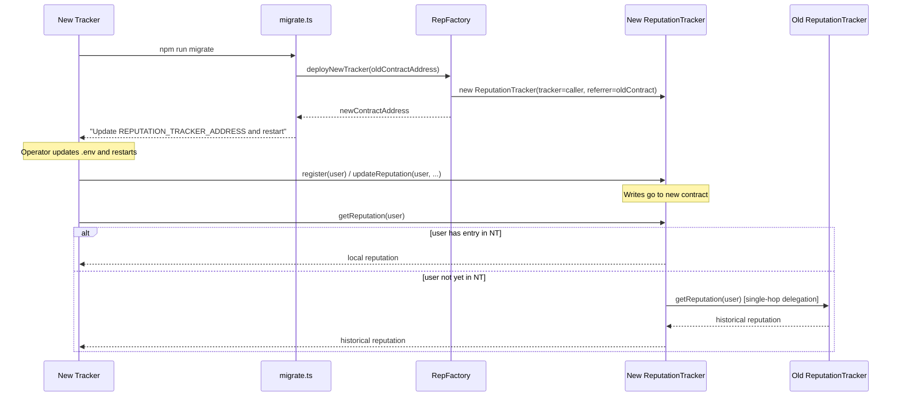

# PBTS Smart Contracts

Solidity smart contracts for the Persistent BitTorrent Tracker System, built with [Foundry](https://book.getfoundry.sh/).

## Contracts

### `ReputationTracker.sol`

The core contract that stores user reputation on-chain. Once deployed, the contract is fully immutable — the tracker address is set at construction and cannot be changed. Each instance is linked to a `REFERRER` — the previous tracker contract — enabling seamless reputation portability across migrations.

**State**

| Variable | Type | Description |
|---|---|---|
| `REFERRER` | `address immutable` | Previous tracker contract (single-hop delegation) |
| `tracker` | `address immutable` | Authorized tracker backend (set once at deployment, never changes) |
| `users` | `mapping(address => UserReputation)` | Per-user reputation store |
| `INITIAL_CREDIT` | `uint256 constant` | 1 GiB (1,073,741,824 bytes) given on registration |

**Struct**

```solidity
struct UserReputation {
    uint256 uploadBytes;
    uint256 downloadBytes;
    uint256 lastUpdated; // 0 means not registered on this contract
}
```

**Functions**

| Function | Access | Description |
|---|---|---|
| `register(address userKey)` | `onlyTracker` | Register a new user with `INITIAL_CREDIT` upload |
| `updateReputation(address user, uint256 uploadDelta, uint256 downloadDelta)` | `onlyTracker` | Increment upload/download counters |
| `getReputation(address user)` | `view` | Returns reputation; delegates to `REFERRER` if user not found locally |
| `getRatio(address user)` | `view` | Returns upload/download ratio scaled by 1e18; delegates to `REFERRER` if needed |

**Referrer delegation** — `getReputation` and `getRatio` use a single-hop fallback: if the user has no entry in the current contract (`lastUpdated == 0`) and `REFERRER != address(0)`, the call is forwarded to the previous contract. This keeps the frontend API identical across migrations.

---

### `RepFactory.sol`

Public, immutable, ownerless factory that deploys new `ReputationTracker` instances. Anyone can call `deployNewTracker` — the caller becomes the permanent tracker of the deployed contract.

**Deployed on Sepolia:** `0xF8b0d08B155329CF696F256d77a1Eb2AcA66A1a9`

**Functions**

| Function | Access | Description |
|---|---|---|
| `deployNewTracker(address _referrer)` | anyone | Deploys a new `ReputationTracker` with the caller as permanent tracker. Reverts if `_referrer` is a non-zero EOA. |

**Events**

```solidity
event NewReputationTracker(
    address indexed newContract,
    address indexed referrer,
    address indexed caller
);
```

---

## Project Structure

```
contracts/
├── src/
│   ├── ReputationTracker.sol   # Core reputation contract
│   └── RepFactory.sol          # Factory for deploying tracker contracts
├── script/
│   └── DeployPBTS.s.sol        # Deployment script (factory + first tracker)
└── test/
    └── ReputationTrackerTest.t.sol  # Foundry tests (registration, ratio, migration)
```

## Prerequisites

- [Foundry](https://book.getfoundry.sh/getting-started/installation)

## Usage

### Build

```bash
forge build
```

### Test

```bash
forge test
```

### Deploy

The Foundry script deploys both `RepFactory` and a first `ReputationTracker`:

```bash
source .env
forge script script/DeployPBTS.s.sol:DeployPBTS \
  --rpc-url "$RPC_URL" \
  --private-key "$DEPLOYER_PRIVATE_KEY" \
  --broadcast
```

Or use the backend deployment script for a more guided experience:

```bash
cd ../backend
npm run deploy
```

## Migration Flow

When a tracker goes down or needs to rotate, a **new tracker** calls the factory to create a new `ReputationTracker` with a referrer pointing to the old tracker's reputation contract.

### Sequence Diagram



### How It Works

```
RepFactory.deployNewTracker(oldTrackerAddress)
    → new ReputationTracker(tracker = caller, referrer = oldTrackerAddress)
    → caller is permanently the authorized tracker
    → getReputation(user) delegates to old contract if user has no new-contract entry
```

- **Immutable contracts**: once deployed, the tracker address and referrer cannot be changed.
- **Single-hop delegation**: `getReputation` and `getRatio` check locally first;
  if the user has `lastUpdated == 0`, the call is forwarded to `REFERRER` once.
- **Zero data migration**: all historical reputation is readable from the new
  contract without copying any state.

See `backend/scripts/migrate.ts` and the backend `POST /migrate` endpoint for
how the operator automates this flow.
